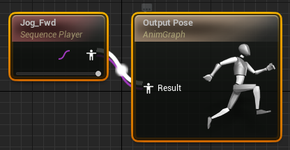
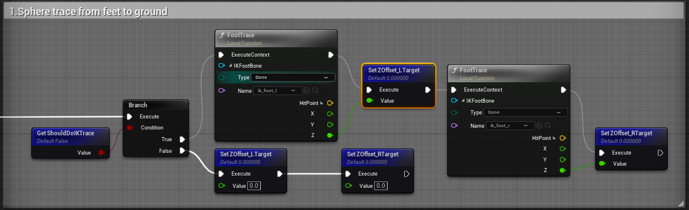
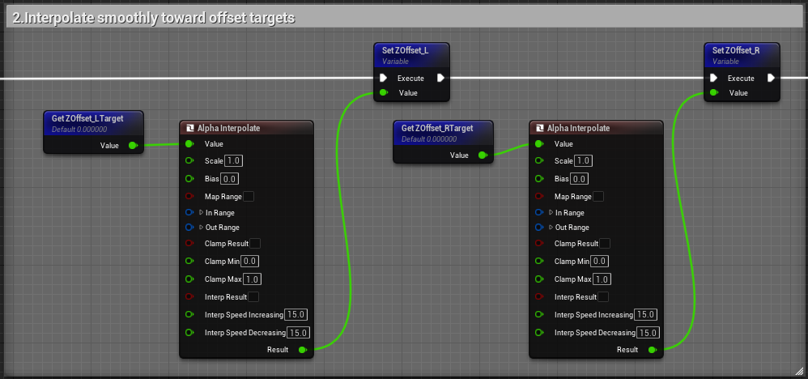
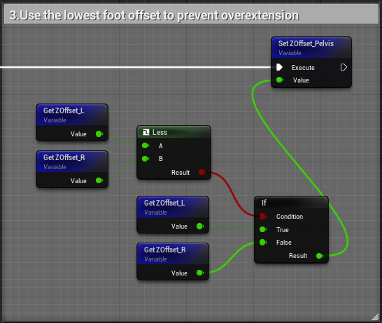
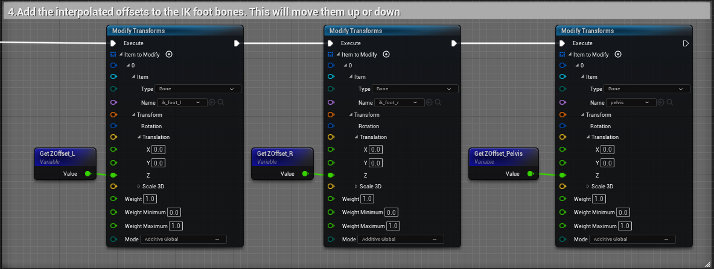
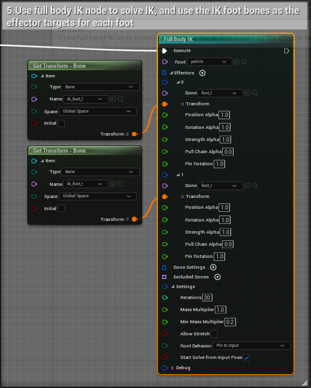
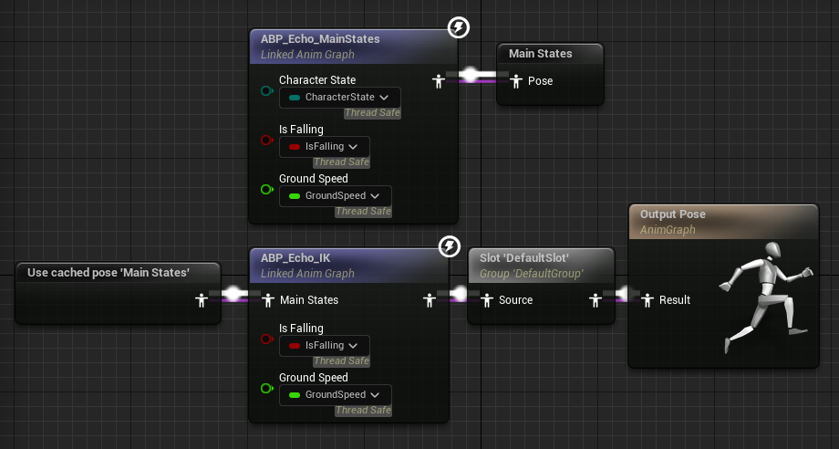

### Animation
我们可以使用 Animation BluePrint 实现 Character 的动作，在 AnimGraph ViewPort，将 Asset 链接到 Output Pose 以驱动角色动画。启用 Details 中的 Loop Animation 循环播放。



为了实现较为复杂的动画组，可以采用 State Machine，在 AnimGraph ViewPort 为不同的动画状态添加转换的条件，用多个 State 与多个状态转变的条件使得 Character 的动画合理其逼真。与此同时，在 Event Graph ViewPort 中计算逻辑并获取 State Machine 需要的相关变量。

<!--more-->


Animation BluePrint 有一个 C++ 父类 Anim Instance，那么可以通过 C++ 来实现上述逻辑，并让 Animation BluePrint 继承 Anim Instance (在Class Settings中)。

```c++ 
// Header
virtual void NativeInitializeAnimation() override;
virtual void NativeUpdateAnimation(float DeltaTime) override;

UPROPERTY(BlueprintReadOnly)
AMyCharacter* MyCharacter;
UPROPERTY(BlueprintReadOnly, Category = Movement)
UCharacterMovementComponent* MyCharacterMovement;
UPROPERTY(BlueprintReadOnly, Category = Movement)
float GroundSpeed;

// Cpp
#include "Characters/MyCharacter.h"
#include "GameFramework/CharacterMovementComponent.h"
#include "Kismet/KismetMathLibrary.h"

void UMyAnimInstance::NativeInitializeAnimation() {
	Super::NativeInitializeAnimation();
	
	MyCharacter = Cast<AMyCharacter>(TryGetPawnOwner());
	if (MyCharacter) {
		MyCharacterMovement = MyCharacter->GetCharacterMovement();
	}
}

void UMyAnimInstance::NativeUpdateAnimation(float DeltaTime) {
	Super::NativeUpdateAnimation(DeltaTime);
	if (MyCharacterMovement) {
		GroundSpeed = UKismetMathLibrary::VSizeXY(MyCharacterMovement->Velocity);
	}
}
```

### Inverse Kinematics
Inverse Kinematics 通过解方程的方法来移动特定的骨骼。
- Sphere trace from feet to ground


- Interpolate smoothly toward offset targets


- Use the lowest foot offset to prevent overextension


- Add the interpolated offsets to the IK foot bones. This will move them up or down


- Use full body IK node to solve IK, and use the IK foot bones as the effector targets for each foot



通过上述步骤，我们实现了关于脚的 IK 动画，接下来需要在 AnimGraph ViewPort 控制动画输出的状态与逻辑。


### IK Rig
[Mixamo](https://www.mixamo.com/) 中有许多基于 X_Bot 骨骼的动画，我们可以通过 IK Rig 实现 Animation 迁移。让不同骨骼的 Character 拥有相同的 Animation。
- 下载 Animation 与 X_Bot
- 创建 IK Rig 选择 X_Bot Skeletal Mesh 并重定位 Skeleton


- 创建 IK Rig 选择目标 Skeletal Mesh 并重定位 Skeleton（与上图相同）
- 创建 IK Retargeter 并调整 Pose 使得 Animation 较为流畅
- 导出 Animation

### Animation Montages
上面的 Animation 是通过 State Machine 实现的，通过判断条件变换 Animation 的状态。那么对于一次性的多种状态的组合，可以使用 Animation Montage 实现。



在设置了 Montage 后，我们可以通过 C++ 将 Animation 与 EnhancedInput 进行绑定，新增一个 enum 类表示 Character 的攻击状态。

```c++
// Attack State
UENUM(BlueprintType)
enum class EActionState : uint8 {
	EAS_Unoccupied UMETA(DisplayName = "Unoccupied"),
	EAS_Attacking UMETA(DisplayName = "Attacking")
};
```

```c++
// Header
EActionState ActionState = EActionState::EAS_Unoccupied;

// Select Animation Montage Asset in BluePrint
UPROPERTY(EditDefaultsOnly, Category = Montages)
UAnimMontage* AttackMontage;
void PlayAttackMontage();

void Attack();
void AttackEnd();
void CanAttack();

// Cpp
void AMyCharacter::Attack() {
	if (CanAttack) {
		PlayAttackMontage();
		ActionState = EActionState::EAS_Attacking;
	}
}

void AMyCharacter::PlayAttackMontage() {
	UAnimInstance* AnimInstance = GetMesh()->GetAnimInstance();

	if (AnimInstance && AttackMontage) {
		AnimInstance->Montage_Play(AttackMontage);
		const int32 Selection = FMath::RandRange(0, 1);

		FName SectionName = FName();

		switch (Selection) {
		case 0:
			SectionName = FName("Attack1");
			break;
		case 1:
			SectionName = FName("Attack2");
			break;
		default:
			break;
		}
		AnimInstance->Montage_JumpToSection(SectionName, AttackMontage);
	}
}

void AMyCharacter::AttackEnd() {
	ActionState = EActionState::EAS_Unoccupied;
}
bool AMyCharacter::CanAttack() {
	return ActionState == EActionState::EAS_Unoccupied &&
		CharacterState != ECharacterState::ECS_Unequipped;
}

```
实现上述 C++ 代码后，我们还需要再 Animation Montage 中设置 Notify，在 Blueprint 中重置 Character 的攻击状态。


### Meta Sounds
为了让 Animation 更加逼真，我们可以添加 Meta Sound。创建了 Meta Sound 后，在 Animation 界面可以添加 Play Sound Notify 在对应的时间播放声音。


### Root Motion Animations
上述实现的动画都是动作形的（没有相对位移）。实现 Root Motion Animations，需要在 Blender 中为 Skeleton 添加 Root。[Converter](https://github.com/enziop/mixamo_converter) 是十分好用的 Blender 插件。此外还需要在 Asset Details->Root Motion 中启用 EnableRootMotion。