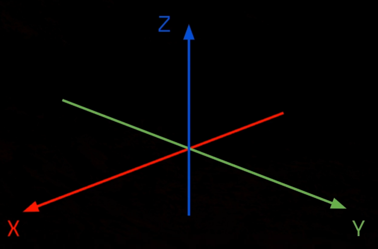

### Coordinates

<!--more-->
### Vectors

### Euler Angle
Unreal Editer 使用 Euler Angle 来描述对象的旋转，旋转的计算过程为 Yaw[Z]→Pitch[Y]→Roll[X]。

### Rotation Matrix
$\vec{AB}$ 通过旋转得到 $\vec{AC}$，其中点 $B$ 的坐标为 $(x, y)$ 通过三角函数可以计算点 $C$ 的坐标为 $(\cos(\alpha+\beta), \sin(\alpha+\beta))$，即 $(x\cos\beta-y\sin\beta, y\cos\beta+x\sin\beta)$

在二维空间中，旋转通常用单一的角 $\theta$ 来定义，约定逆时针方向旋转为正，旋转矩阵为
$$
M(\theta) = \begin{bmatrix}\cos\theta& -\sin\theta\\\sin\theta&\cos\theta\\
\end{bmatrix} = \cos\theta\begin{bmatrix}1&0\\0& 1 \\\end{bmatrix} + \sin\theta\begin{bmatrix}0&-1\\1&0\\\end{bmatrix} = \exp(\theta\begin{bmatrix}0&-1\\1&0\\\end{bmatrix})
$$

通过二维向量的旋转规则直接给出三维空间中的旋转矩阵
- ${\mathcal{R}}_{x}(\theta_{x})={\begin{bmatrix}1&0&0\\0&\cos {\theta_{x}}&-\sin{\theta_{x}}\\0&\sin {\theta_{x}}&\cos {\theta_{x}}\end{bmatrix}}=\exp\left(\theta_{x}{\begin{bmatrix}0&0&0\\0&0&-1\\0&1&0\end{bmatrix}}\right)$

- ${\mathcal{R}}_{y}(\theta_{y})={\begin{bmatrix}\cos{\theta_{y}}&0&\sin{\theta_{y}}\\0&1&0\\-\sin {\theta_{y}}&0&\cos{\theta_{y}}\end{bmatrix}}=\exp\left(\theta_{y}{\begin{bmatrix}0&0&1\\0&0&0\\-1&0&0\end{bmatrix}}\right)$

- ${\mathcal{R}}_{z}(\theta_{z})={\begin{bmatrix}\cos {\theta_{z}}&-\sin{\theta_{z}}&0\\\sin{\theta_{z}}&\cos{\theta_{z}}&0\\0&0&1\end{bmatrix}}=\exp\left(\theta_{z}{\begin{bmatrix}0&-1&0\\1&0&0\\0&0&0\end{bmatrix}}\right)$