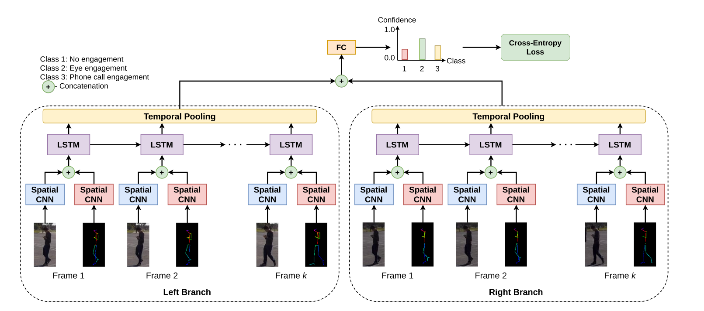

### Introduction

随着智能手机的普及，与手机相关的分心行为已经造成了许多交通死亡和事故。利用计算机视觉对行人分心行为的检测通常采用有监督学习的方式。本文在虚拟世界模拟出行人与手机相关的分心行为和正常行为，通过**CNN**的空间特征提取和基于**LSTM**的时间特征来实现时空特征学习。最后，使用姿势感知迁移学习将**从合成数据中获得的知识转移到真实数据**。
<!--more-->
###### 姿势感知学习策略

- 微调
- 2D人体姿势特征嵌入（2D人体姿态是合成数据和真实数据之间相对稳定的特征，使用2D人体姿态特征作为迁移学习的域不变特征。）

###### 主要贡献

- 提出了深度学习模型**PPDBNet**
- 提出了新的数据集**SYN-PPDB**
- 提升了识别的准确率

### Synthetic Dataset: SYN-PPDB

###### 该数据集由Unity生成，场景包含

- 10名身高、衣服、行走速度各不相同的演员，这些演员由5名男性和5名女性组成
- 行驶速度为$1m/s$的车辆，并且前挡板装有两个摄像头

###### 该数据集共有448个视频

- 每个视频长$2s$，每秒30帧
- 像素为64$×$128
- 相应的电话行为相关的标签$\{c_1, c_2, c_3\}$

### Method

$$
\mathcal{X} = \{X_L=(I_L, P_L),X_R=(I_R,P_R)\},\mathcal{Y}\in\{c_1,c_2,c_3\}
$$

- $\mathcal{X}$：来自左右两摄像机的图像序列$X_L,X_R$

- $X$：包含了外观部分$I$和姿势部分$P$
- $\mathcal{Y}$：电话相关行为的标签序列

##### NetWork(PPDBNet)

$$
f=Pooling(X)=\frac{\Sigma^k_{i=1}x_i}{k}
$$

- $X = [x_1,\cdots,x_T]\in\mathbb{R}$：时间池化层的输入

$$
Loss(\mathcal{X}, y) = -\Sigma^{n}_{j=1}y_i\log{v_j}
$$

#### Transfer learning strategies

- 用OpenPose将2D人体姿态从图像中提取出来
- 用合成的2D人体姿态数据训练网络
- 用真实的数据对网络进行微调
