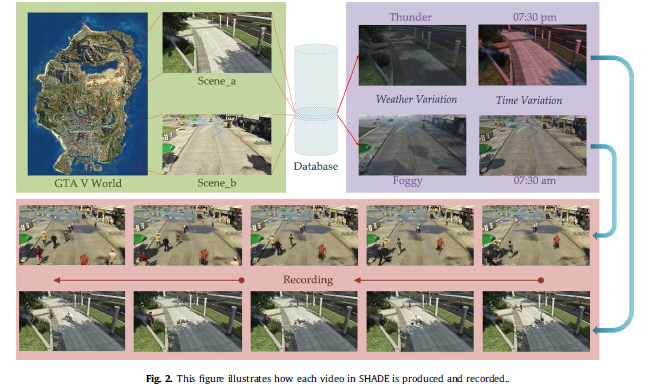
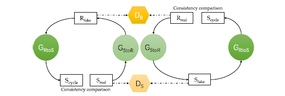

### Introduction

神经网络强大的学习能力提升了异常检测的能力，但异常事件很少出现在现实世界中。本文在GTA5中人工设计异常事件并记录，采用C3DGAN消除两个领域之间的差异。

### Related work

现有的异常行为检测方法大体上分为局部方法和全局方法，前者从帧检测异常行为，后者从视频中检测异常行为。传统的全局方法又分为三类：基于轨迹点的方法、基于光流的模型和基于分类的模型。

### Synthetic Abnormality Dataset

SHADE数据集是利用Script Hook V从GTA5中记录产生的，该数据集囊括了9种行为与7中天气情况。

### Abnormal Video detection method

### Cyclic 3D GAN

用SHADE训练的模型直接在真实世界的应用效果可能不太理想，C3DGAN则是用来消除合成数据与真实数据之间的差异。

在合成数据集上训练异常视频检测器，C3DGAN将合成视频转换为照片级别真实感数据，用真实数据测试该模型。

训练4个神经网络，两个生成网络以及两个对抗网络，$G_{StoR}$、$G_{RtoS}$分别用于生成从S到R和从R到S的视频，$D_S$、$D_R$鉴别视频是否属于S、R。

$loss = min\max{L(G_{StoR,G_RtoS,D_R,D_S})}$
